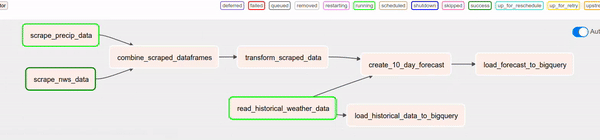
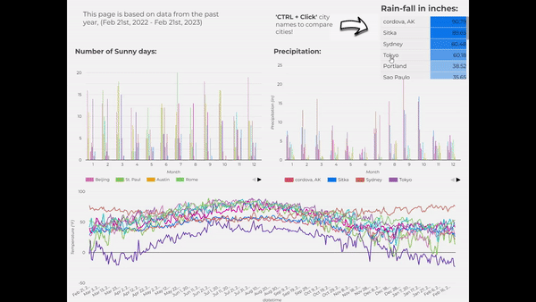

# Weather Forecaster
Uses machine learning to predict the weather

#### By [Reed Carter]
This project will use weather data and machine learning to crease a 10 day weather forecast presented on a looker studio dashboard for 11 cities around the country.

Airflow will orchestrate the pipeline so the forecast remains current. 

### Technologies Used

* Python (BeautifulSoup)
* Airflow (via Docker)
* Google Cloud Platform (BigQuery, Looker Studio)
* SQL
 
### Dashboard Presentations


### Data Sources

* [National Weather Service](https://www.weather.gov/)
* [Local Conditions](https://www.localconditions.com/weather-milwaukee-wisconsin/53201/past.php)
* [NOAA API](https://www.ncei.noaa.gov/cdo-web/search)

### The Process

Current weather conditions including precip, high temps, low temps, humidity, etc. are scraped from the NWS using beautiful soup. That data is then cleaned and transformed to be inputted into the forecasting model to produce a 10 day forecast estimating high temps of 11 cities around the US. The forecasting model uses the Sklearn library in python to perform a multiple linear regression to make the prediction. The data is then uploaded to google BigQuery to be presented in looker studio. 

The airflow dag specifying each task can be found below as well as a graph demonstrating the actual and predicted temperatures of the model for the city of Fairbanks, AK in the year 2022. 




### Results

The results were displayed on a looker studio dashboard which can be found [here](https://lookerstudio.google.com/reporting/a89d9167-97f7-4bfa-8d0f-df683482449e/page/prvHD)





### Setup/Installation Requirements
**_Clone repo to your local system:_**

1. Make a directory on your disk where you would like to clone the repo.

2. Copy the repo link: https://github.com/Reed-Carter/Weather_Forcaster (available if you click the green "Code" dropdown button on this page).

3. Open your terminal and change into the directory you made (`cd /path/to/new/directory`).

4. Type `git clone ` and paste the URL.


**_Install required packages:_**

These installation instructions assume you have pip, virtualenv, and [Docker Desktop](https://www.docker.com/products/docker-desktop/) installed. 


```bash 
# Create and activate virtual environment
virtualenv -p python3.7 venv 
source venv/bin/activate

# Install packages from requirements.txt
pip install -r requirements.txt

# Install Airflow 
AIRFLOW_VERSION=2.3.2 
PYTHON_VERSION=3.7 
CONSTRAINT_URL="https://raw.githubusercontent.com/apache/airflow/constraints-${AIRFLOW_VERSION}/constraints-${PYTHON_VERSION}.txt"
pip install "apache-airflow[async,postgres,google]==${AIRFLOW_VERSION}" --constraint "${CONSTRAINT_URL}"
```
The structure of this repo is currently organized into three separate subdirectories containing each group member's work. For the time being, you can create your own airflow directory in the root of this repository and copy any of our DAGs into it if you are interested in running them for yourself.   

```bash
# Make and change to airflow subdirectory
mkdir airflow && cd "_$"
mkdir ./dags ./plugins ./logs # create subdirectories 

# Download docker-compose.yaml and set the .env  
curl -LfO 'https://airflow.apache.org/docs/apache-airflow/stable/docker-compose.yaml'
echo -e "AIRFLOW_UID=$(id -u)\nAIRFLOW_GID=0" > .env
```
Prior to initializing Airflow in Docker, you will need to [create a project](https://cloud.google.com/resource-manager/docs/creating-managing-projects) and an associated [service account](https://cloud.google.com/iam/docs/creating-managing-service-accounts) in BigQuery. After downloading the account's credential file, you can configure your `docker-compose.yaml` to connect to BigQuery: 

```yaml 
  GOOGLE_APPLICATION_CREDENTIALS: /google_creds/<name-of-your-creds-file>.json
volumes:
  - ${AIRFLOW_PROJ_DIR:-.}/dags:/opt/airflow/dags
  - ${AIRFLOW_PROJ_DIR:-.}/logs:/opt/airflow/logs
  - ${AIRFLOW_PROJ_DIR:-.}/plugins:/opt/airflow/plugins
  - ${AIRFLOW_PROJ_DIR:-.}/data:/opt/airflow/data
  - </path/to/your/creds/directory>:/google_creds
```
After opening Docker Desktop (or starting docker [via CLI](https://docs.docker.com/config/daemon/start/)): 

```bash
# Create and start Docker container from airflow-init image
docker compose up airflow-init
docker compose up 
```
</br>

## Known Bugs

* No known bugs

<br>

## License

MIT License

Copyright (c) 2023 Alejandro Socarras, Drew White, Reed Carter 

Permission is hereby granted, free of charge, to any person obtaining a copy of this software and associated documentation files (the "Software"), to deal in the Software without restriction, including without limitation the rights to use, copy, modify, merge, publish, distribute, sublicense, and/or sell copies of the Software, and to permit persons to whom the Software is furnished to do so, subject to the following conditions:

The above copyright notice and this permission notice shall be included in all copies or substantial portions of the Software.

THE SOFTWARE IS PROVIDED "AS IS", WITHOUT WARRANTY OF ANY KIND, EXPRESS OR IMPLIED, INCLUDING BUT NOT LIMITED TO THE WARRANTIES OF MERCHANTABILITY, FITNESS FOR A PARTICULAR PURPOSE AND NONINFRINGEMENT. IN NO EVENT SHALL THE AUTHORS OR COPYRIGHT HOLDERS BE LIABLE FOR ANY CLAIM, DAMAGES OR OTHER LIABILITY, WHETHER IN AN ACTION OF CONTRACT, TORT OR OTHERWISE, ARISING FROM, OUT OF OR IN CONNECTION WITH THE SOFTWARE OR THE USE OR OTHER DEALINGS IN THE SOFTWARE.